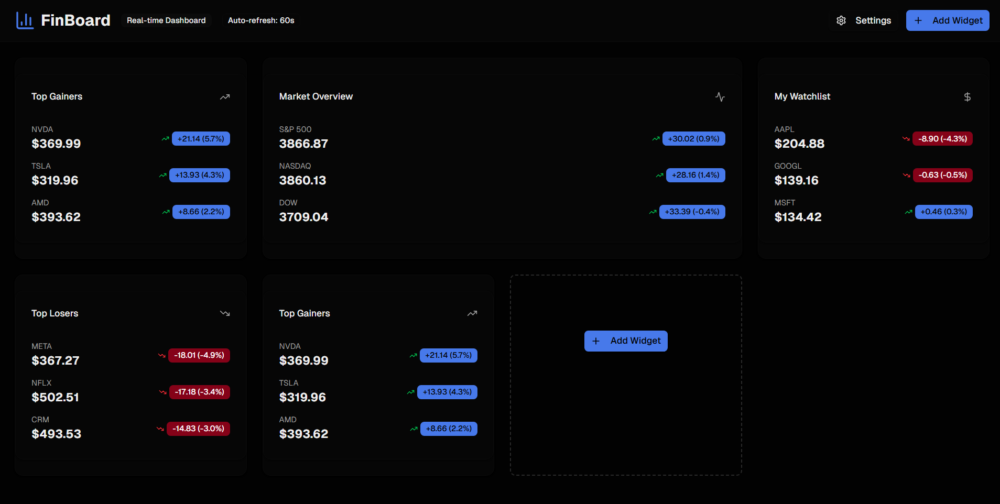
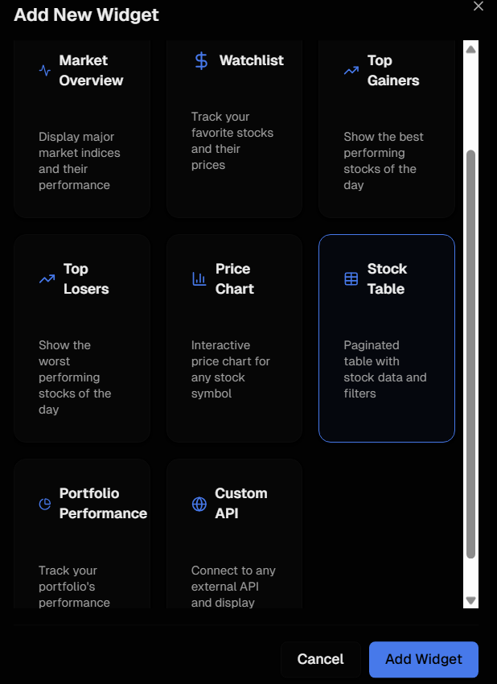
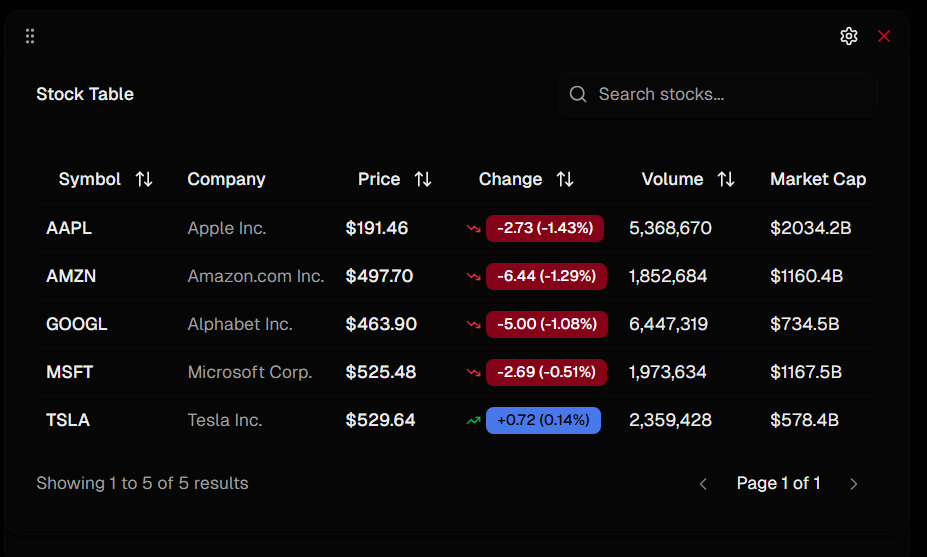
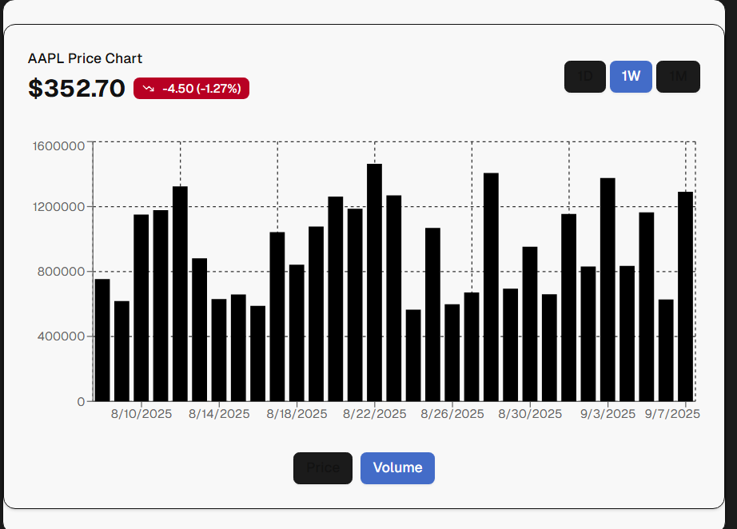
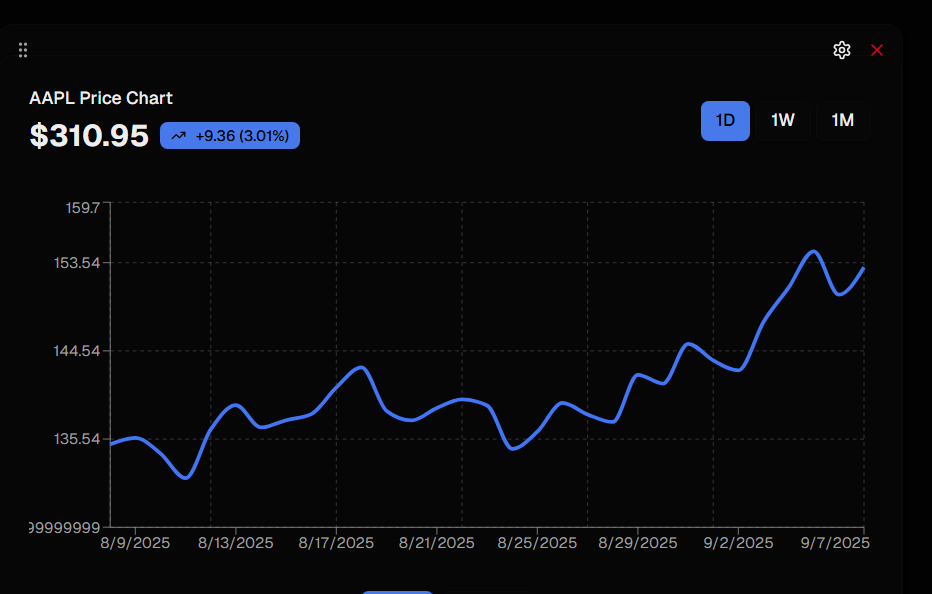
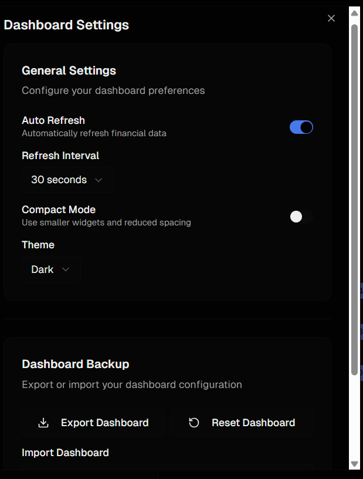

# FinBoard - Customizable Finance Dashboard

A modern, real-time finance monitoring dashboard that allows users to build their own customizable financial data visualization platform with drag-and-drop widgets and seamless API integration.

## 🚀 Features

### Widget Management System
- **Add Widgets**: Create new finance data widgets by connecting to financial APIs
- **Remove Widgets**: Easy deletion of unwanted widgets from the dashboard
- **Drag & Drop**: Rearrange widget positions with intuitive drag-and-drop functionality
- **Widget Configuration**: Customizable settings panel for each widget type

### Widget Types
- **Market Overview**: Real-time market indices and key financial metrics
- **Stock Tables**: Paginated lists with filters, search, and sorting functionality
- **Financial Charts**: Interactive candlestick and line charts with multiple timeframes
- **Watchlist**: Personal stock tracking with real-time price updates
- **Gainers/Losers**: Top performing and declining stocks
- **Portfolio Tracking**: Investment performance monitoring

### API Integration & Data Handling
- **Multiple Providers**: Support for Alpha Vantage, Finnhub, and Polygon APIs
- **Real-time Updates**: Automatic data refresh with configurable intervals
- **Data Caching**: Intelligent caching system to optimize API calls
- **Rate Limiting**: Built-in protection against API quota limits
- **Secure Architecture**: Server-side API key management

### User Interface & Experience
- **Responsive Design**: Fully responsive layout for all screen sizes
- **Dark/Light Themes**: Dynamic theme switching
- **Loading States**: Comprehensive loading and error state handling
- **Professional Design**: Finance-focused UI with modern aesthetics

### Data Persistence
- **Browser Storage**: All configurations persist across sessions
- **State Recovery**: Complete dashboard restoration on page refresh
- **Export/Import**: Backup and share dashboard configurations
- **Settings Management**: Customizable refresh intervals and display options

## 🛠️ Technologies

- **Frontend**: Next.js 14 with App Router
- **Styling**: Tailwind CSS v4 with custom design tokens
- **State Management**: Zustand with persistence middleware
- **Data Visualization**: Recharts for interactive charts
- **Drag & Drop**: @dnd-kit for accessible drag-and-drop functionality
- **UI Components**: Custom component library with shadcn/ui foundation
- **API Integration**: Server-side API routes with client-side hooks

## 🖼️ Screenshots

| Dashboard | Add Widget |
|-----------|------------|
|  |  |

| Stock Table | Financial Chart | Financial Price |
|-------------|-----------------|-----------------|
|  |  |

| Settings |
|----------|
|  |

## 📦 Installation

### Prerequisites
- Node.js 18+ 
- npm or yarn package manager

### Setup Instructions

1. **Clone the repository**
   \`\`\`bash
   git clone <repository-url>
   cd finboard-dashboard
   \`\`\`

2. **Install dependencies**
   \`\`\`bash
   npm install
   # or
   yarn install
   \`\`\`

3. **Environment Variables**
   Create a `.env.local` file in the root directory and add your API keys:
   \`\`\`env
   ALPHA_VANTAGE_API_KEY=your_alpha_vantage_key
   FINNHUB_API_KEY=your_finnhub_key
   POLYGON_API_KEY=your_polygon_key
   \`\`\`

4. **Run the development server**
   \`\`\`bash
   npm run dev
   # or
   yarn dev
   \`\`\`

5. **Open your browser**
   Navigate to `http://localhost:3000` to view the dashboard

## 🔑 API Keys Setup

### Alpha Vantage
1. Visit [Alpha Vantage](https://www.alphavantage.co/support/#api-key)
2. Sign up for a free account
3. Generate your API key
4. Add to environment variables as `ALPHA_VANTAGE_API_KEY`

### Finnhub
1. Visit [Finnhub](https://finnhub.io/register)
2. Create a free account
3. Get your API key from the dashboard
4. Add to environment variables as `FINNHUB_API_KEY`

### Polygon
1. Visit [Polygon.io](https://polygon.io/pricing)
2. Sign up for an account
3. Generate your API key
4. Add to environment variables as `POLYGON_API_KEY`

## 🎯 Usage

### Adding Widgets
1. Click the "Add Widget" button in the top-right corner
2. Select from available widget types:
   - Market Overview
   - Stock Table
   - Financial Chart
   - Watchlist
   - Gainers/Losers
   - Portfolio
3. Configure widget settings as needed
4. Click "Add Widget" to add to your dashboard

### Customizing Layout
- **Drag & Drop**: Hover over any widget to see the drag handle, then drag to reorder
- **Remove Widgets**: Click the X button that appears when hovering over a widget
- **Configure Widgets**: Click the settings icon to customize individual widgets

### Dashboard Settings
- **Theme**: Toggle between light and dark modes
- **Auto-refresh**: Set automatic data refresh intervals (30s, 1m, 5m, 15m)
- **Compact Mode**: Enable for denser widget layouts
- **Export/Import**: Backup or restore dashboard configurations

### Data Management
- **Real-time Updates**: Data automatically refreshes based on your settings
- **Manual Refresh**: Click refresh icons on individual widgets
- **Offline Mode**: Dashboard works with cached data when APIs are unavailable

## 🏗️ Project Structure

\`\`\`
finboard-dashboard/
├── app/
│   ├── api/financial/          # Server-side API routes
│   ├── globals.css             # Global styles and design tokens
│   ├── layout.tsx              # Root layout component
│   └── page.tsx                # Main dashboard page
├── components/
│   ├── dashboard-settings.tsx  # Settings panel component
│   ├── drag-drop-context.tsx   # Drag & drop provider
│   ├── draggable-widget.tsx    # Draggable widget wrapper
│   ├── financial-cards.tsx     # Financial data card components
│   ├── financial-chart.tsx     # Interactive chart component
│   ├── stock-table.tsx         # Data table component
│   └── widget-manager.tsx      # Widget management system
├── hooks/
│   └── use-financial-data.ts   # Custom data fetching hooks
├── lib/
│   ├── api/
│   │   └── financial-api.ts    # Client-side API service
│   └── stores/
│       └── dashboard-store.ts  # Zustand state management
└── README.md
\`\`\`

## 🔒 Security

- **Server-side API Keys**: All API keys are stored securely on the server
- **No Client Exposure**: Financial API keys never reach the browser
- **Rate Limiting**: Built-in protection against API abuse
- **Error Handling**: Graceful fallbacks for API failures

## 🚀 Deployment

### Vercel (Recommended)
1. Push your code to GitHub
2. Connect your repository to Vercel
3. Add environment variables in Vercel dashboard
4. Deploy automatically

### Other Platforms
The application can be deployed to any platform that supports Next.js:
- Netlify
- AWS Amplify
- Railway
- DigitalOcean App Platform

## 🤝 Contributing

1. Fork the repository
2. Create a feature branch (`git checkout -b feature/amazing-feature`)
3. Commit your changes (`git commit -m 'Add amazing feature'`)
4. Push to the branch (`git push origin feature/amazing-feature`)
5. Open a Pull Request

## 📝 License

This project is licensed under the MIT License - see the [LICENSE](LICENSE) file for details.

## 🆘 Support

If you encounter any issues or have questions:

1. Check the [Issues](../../issues) section for existing solutions
2. Create a new issue with detailed information
3. Contact support through the provided channels

## 🙏 Acknowledgments

- [Alpha Vantage](https://www.alphavantage.co/) for financial data API
- [Finnhub](https://finnhub.io/) for real-time market data
- [Polygon.io](https://polygon.io/) for comprehensive financial data
- [Recharts](https://recharts.org/) for beautiful data visualization
- [Zustand](https://github.com/pmndrs/zustand) for state management
- [Tailwind CSS](https://tailwindcss.com/) for styling framework

---

**FinBoard** - Build your perfect finance dashboard, your way. 📊
